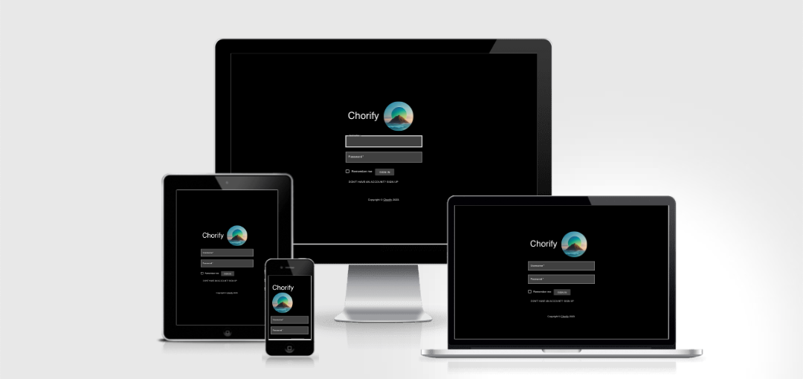
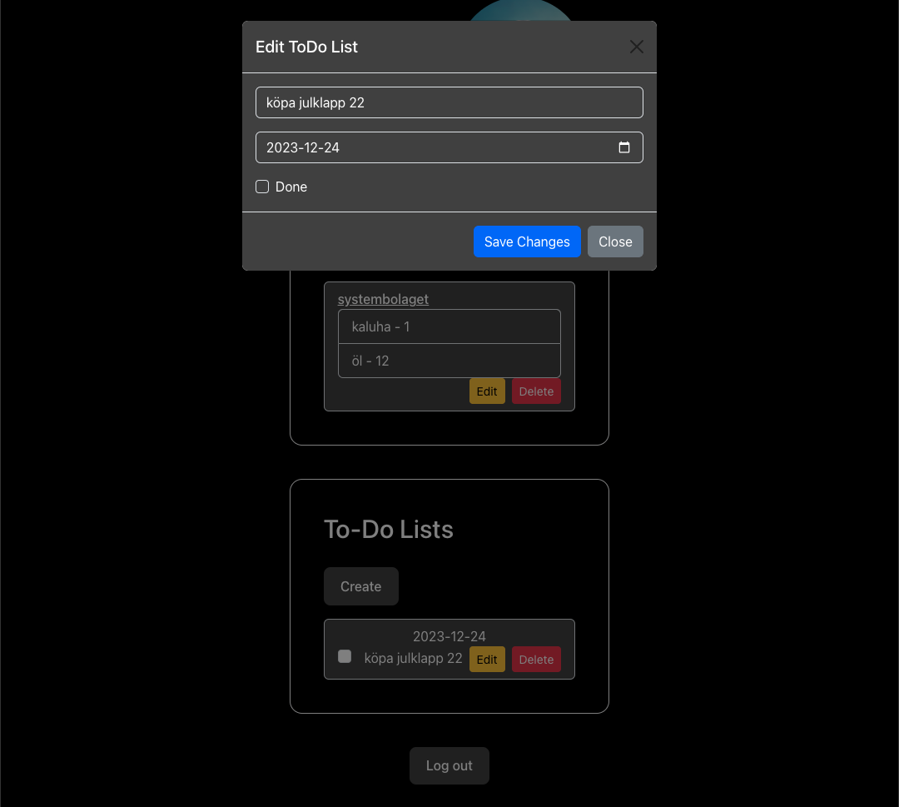

# Chorify the simplistic chorekeeper app
Welcome to Chorify, a task management application crafted with a mobile-first approach to streamline and organize your daily life. Our app is designed to keep you focused solely on your chores, thanks to its elegant black and white Scandinavian design. This minimalist aesthetic not only enhances user focus but also brings a familiar and consistent experience across devices. The design and layout you love on mobile are mirrored on desktop, ensuring you always recognize and comfortably navigate the app. Built using Vite+React for a fluid and intuitive user experience on mobile, Chorify also features a robust backend powered by Django Rest Framework, maintaining high performance and reliability across all platforms. Experience the simplicity and efficiency of task management with Chorify's seamless, mobile-first design.

Link to the deployed version: [Chorify-App](https://chorify-554b3183ed2e.herokuapp.com/)


## Table of Contents

## User Experience Design

### Strategy

Our application, Chorify, is strategically designed to offer a streamlined and intuitive user experience, focusing on simplicity and functionality. The design approach is minimalist, drawing inspiration from Scandinavian aesthetics, which is reflected in the black and white color scheme and clean interface. This not only ensures a distraction-free environment but also makes the application easy to navigate and use.

The app's architecture is developed with a mobile-first approach, ensuring optimal performance and user experience on mobile devices. This design philosophy is consistently mirrored across desktop platforms, providing a familiar and coherent user interface across all devices.

Key features such as Shopping Lists and To-Do Lists are developed with full CRUD (Create, Read, Update, Delete) functionality to maximize user interaction and productivity. User feedback and testing have played a significant role in refining these features, ensuring they meet the practical needs of our users.

### Target Audience

Chorify is designed for individuals who value organization and efficiency in their daily lives. Our primary target audience includes:

- **Busy Professionals:** Who need to manage their day-to-day tasks and shopping needs efficiently.
- **Students:** Looking for a simple tool to organize their study schedules, assignments, and personal tasks.
- **Families:** Needing a collaborative tool to manage household chores and shopping lists.
- **Minimalist Enthusiasts:** Users who appreciate a clean, straightforward, and clutter-free interface for managing their tasks.

Our application is suitable for anyone who desires a seamless and straightforward digital solution for managing their everyday tasks and shopping lists, regardless of their tech-savvy level.

### Responsiveness



In the design of Chorify, we have embraced a mobile-first approach, acknowledging the growing prevalence of mobile devices in our daily lives. This strategy ensures that the core functionality and aesthetic appeal of the app are optimized for smaller screens, delivering a seamless and efficient user experience on mobile devices.

- **Mobile Optimization:** The user interface on mobile is intuitive and accessible, with touch-friendly elements and easily readable fonts. The minimalist Scandinavian design, characterized by its black and white palette and clean lines, translates perfectly on mobile devices, ensuring clarity and ease of use.

- **Uniform Experience Across Devices:** The design and layout that users love on mobile are consistently reflected on desktop and tablet interfaces. This coherence in design across platforms maintains the simplicity and elegance of the app, while also offering a familiar user experience regardless of the device used.

- **Adaptability and Flexibility:** Despite the mobile-first design, we ensured that the app's interface scales gracefully on larger screens. On desktop and tablet, the layout adjusts to make efficient use of the available screen real estate, while preserving the uncluttered and user-centric design ethos.

- **Performance and Accessibility:** Across all platforms, the app maintains high performance and accessibility standards. The responsive design ensures that the app is not only visually appealing but also fully functional, accommodating various screen sizes and resolutions without compromising on speed or user experience.

By focusing on a mobile-first strategy and extending the same design principles across desktop and tablet versions, Chorify offers a consistent and high-quality user experience. This approach underlines our commitment to accessibility and ease of use, making Chorify a reliable and practical tool for everyday task management.


### User Stories

#### First Time Visitor Goals

1. **Discoverability and Ease of Use:**
   - As a first-time visitor, I want to quickly understand the purpose of the app and how to use it, so I can start managing my tasks and shopping lists without any confusion.

2. **Efficient Task Management:**
   - I want to easily create and manage my to-do lists and shopping lists, so I can organize my daily activities efficiently.

3. **Intuitive Interface:**
   - The app should provide an intuitive interface that guides me through its features, making my first interaction smooth and pleasant.

4. **Seamless Onboarding:**
   - I expect a straightforward registration process, allowing me to set up my account and start using the app with minimal effort.

5. **Responsive Design:**
   - The app should work well on my mobile device, as I prefer to manage tasks on the go.

#### Frequent Visitor Goals

1. **Quick Access to Lists:**
   - As a frequent user, I need to quickly access my shopping and to-do lists for updates or reviews, saving time in my busy schedule.

2. **Edit and Update Efficiency:**
   - I want the ability to easily edit and update my lists, as my tasks and shopping needs often change.

3. **Reliability and Consistency:**
   - The app should consistently perform well, keeping my data safe and available whenever I need it.

4. **Sync Across Devices:**
   - I expect the app to sync my data seamlessly across devices, so I can switch between my phone and computer effortlessly.

5. **Progress Tracking:**
   - The app should help me track my progress on tasks and shopping, giving me a sense of accomplishment and aiding in organization.

These user stories guide the design and development of Chorify, ensuring that we meet and exceed the expectations of our users, from their first visit to their regular use.

---

## Technologies used
---
- ### Languages:
    - **React**, Chosen for its exceptional capability in building dynamic and responsive user interfaces. React's component-based architecture allows for efficient development and easy maintenance, making it ideal for creating an engaging and interactive front-end experience.
    - **HTML**, The backbone of our app's structure. HTML provides the essential framework, enabling us to define the content and layout with clarity and precision. Its simplicity and effectiveness are the reasons we relied on it for structuring our web content.
    - **CSS**, Selected for its powerful styling capabilities. CSS allows us to create a visually appealing and consistent design across our application. Its flexibility and control over the presentation layer bring our user interface to life with elegant and responsive design elements.
    - **Django**, The heart of our back-end development. We chose Django for its robustness, scalability, and security features. Its ability to handle complex data and deliver high-performance web applications makes it a perfect fit for our backend needs. Django’s extensive libraries and ORM for database interactions streamline our development process, ensuring a solid and efficient back-end architecture.
    
- ### Frameworks and Libraries:
    - **Django REST**, We chose the Django REST Framework for its powerful and flexible toolkit for building Web APIs. It's particularly effective in handling serialization and providing a clean, browsable API, which is crucial for efficiently developing and maintaining the data layer of our application. Its compatibility with Django makes it a natural choice for extending our backend capabilities.
    - **Vite**, Vite was selected for its incredibly fast build tool that significantly enhances the development experience. By leveraging native ES modules, Vite provides lightning-fast server start and hot module replacement (HMR), which boosts our productivity and shortens the feedback loop during development. Its simplicity and performance optimizations are key for a smooth and efficient frontend build process.
    - **Material UI**, Material UI was implemented in the SignIn component, but because of my love for bootstrap and its more intuitive for me I chose to make the rest of the UI with bootstrap. Inspired by Google's Material Design, it offers a comprehensive suite of pre-designed components and customization options.
    - **Bootstrap 5**, Bootstrap 5 is an excellent framework for crafting responsive and mobile-first layouts. We incorporated it for its vast array of ready-to-use components and its grid system, which simplifies the design process. The flexibility and ease of customization provided by Bootstrap 5 enable us to rapidly develop adaptive layouts that look great on all devices.

- ### Databases:
    - **PostgreSQL on ElephantSQL**, We selected PostgreSQL, hosted on ElephantSQL, for our database needs, owing to PostgreSQL's reputation as a robust, open-source relational database system. Known for its reliability, data integrity, and scalability, PostgreSQL offers a versatile and powerful foundation for handling complex queries and large datasets. ElephantSQL, as our chosen hosting service, enhances this experience by providing a fully-managed PostgreSQL hosting that is reliable and easy to set up. This combination ensures our database is not only performant but also secure and accessible, with ElephantSQL handling the intricacies of database management. This setup allows us to focus on development without worrying about database administration, making our workflow more efficient and effective. The choice of PostgreSQL on ElephantSQL aligns perfectly with our need for a powerful database solution that is both manageable and scalable.

- ### Tools:
    - **dj-rest-auth**, Streamlines creation of RESTful authentication endpoints in Django.
    - **django-cors-headers**, Manages Cross-Origin Resource Sharing (CORS) for secure API interactions.
    - **Gunicorn**, A robust WSGI server for deploying Django applications.
    - **psycopg2**, Connects Django to PostgreSQL, offering powerful database functionalities.
    - **PyJWT**, Handles JSON Web Tokens for secure authentication.
    - **Whitenoise**, Simplifies static file management in Django applications.
    - **Git and GitHub**, Version control system used for source code management.
    - **Heroku**, Cloud hosting service for deploying applications.
    - **VS Code**, IDE used for development.

## Features

Chorify offers a suite of tools to enhance your daily organization and productivity. Our application is designed with intuitive interfaces and provides full CRUD (Create, Read, Update, Delete) functionality across its features. Here's what you can do with Chorify:

### Shopping Lists:
- **Create and Manage Shopping Lists:** Effortlessly create shopping lists with a user-friendly interface. Each list has a distinct name, which also doubles as the title.
- **Item Management:** Add any number of item-name and quantity pairs to your lists. Customize your lists to suit your shopping needs.
- **Collapsible View:** Shopping lists are displayed in a compact, collapsible format. The list name, along with edit and delete buttons, are visible upfront. Clicking on a list unfolds it to reveal all the items and quantities.
- **Modal Editor:** Adding or editing shopping lists is a breeze with our modal editor. It pops up conveniently, allowing you to make quick changes without leaving your current view.

### To-Do Lists:
- **Full-Featured To-Do Lists:** Organize your tasks with our comprehensive to-do list feature. 
- **Due Date Setting:** For each task, set a due date to keep track of your deadlines.
- **Task Descriptions:** Add detailed descriptions to your tasks to remember important details.
- **Progress Tracking:** Each task comes with a checkbox to mark it as done, giving you a clear view of your progress.
- **Edit and Delete Options:** Manage your tasks with ease using the edit and delete functions, ensuring your to-do list is always up-to-date and relevant.

Each feature of Chorify is designed to enhance your organizational efficiency, making everyday tasks simpler and more manageable. Whether you're planning your shopping or organizing your to-dos, Chorify has the tools you need.


## Future Improvements and Features

At Chorify, we're committed to continuously enhancing the user experience and functionality of our app. Here's a glimpse of what we're planning for the future:

### Enhanced To-Do List Sorting:
- **Sort by Due Date:** Introducing the ability to sort to-do items by their due dates, helping you prioritize tasks more effectively.
- **Sort by Status:** Implementing sorting functionality based on completion status (done/not done), allowing for a more organized view of your tasks.

### Overdue Task Highlighting:
- **Highlight Overdue Items:** We aim to add a feature that highlights to-do items that have passed their due date and are yet to be marked as done. This will ensure important tasks do not get overlooked.

### Shopping List Sharing:
- **Share via Email and Messaging Apps:** We're planning to enable sharing of shopping lists through various channels, including email and popular messaging apps like WhatsApp and Meta Messenger. This feature will make it easier to collaborate on shopping tasks with family and friends.

Each of these upcoming features is designed with the goal of making Chorify even more versatile and user-friendly. Stay tuned for these exciting updates!

### Calendar Integration:
- **Calendar Integration:** We're excited to bring the ability to add tasks to your calendar. This feature will make it easier to keep track of your tasks and events. And allow for the creation of recurring tasks and shoppinglists.
---

## Design Philosophy

At Chorify, we've embraced a design ethos that marries functionality with minimalist aesthetics, drawing inspiration from the elegant simplicity of Scandinavian design. Here's an overview of our design choices:

### Black and White Simplicity:
- **Monochrome Palette:** Our app features a classic black and white color scheme, punctuated with shades of gray and dark gray elements. This choice reflects the timeless elegance and straightforwardness of Scandinavian design.
- **Minimalist Aesthetics:** We've deliberately chosen a non-flashy, uncomplicated design. By avoiding visual clutter, we ensure that the interface is clean, user-friendly, and easy on the eyes.

### Focus on Functionality:
- **User-Centric Design:** The primary aim of our design is to keep the user’s focus on the app's core functionality – serving as a reminder and assistant for day-to-day chores.
- **Clarity and Usability:** Every design element is crafted to enhance usability. The simplicity of the design ensures that users can navigate the app intuitively and efficiently, making task management stress-free and straightforward.

This design approach not only makes Chorify aesthetically pleasing but also ensures that the app remains practical and useful, staying true to its purpose of simplifying your daily life.

### Accessibility

- **Readable Typography:** Text is presented in a clear, legible font, ensuring readability across all devices and screen sizes.

- **Contrast and Color:** High contrast between text and background improves readability, while the monochromatic color scheme minimizes visual strain.

### Color Scheme


### Imagery
The only Image in this app is the logo that is AI generated with [Gencraft](https://gencraft.com/generate)


### Wireframes


<details>


</details>
---

### Screenshots

<details>

Log in:

---

Sign up:

---

Create new shoppinglist:

---

Edit shoppinglists:

---

Expanding shoppinglists to see content:

---

Create new todo item:

---

Edit todo item:

---

</details>
---

## Information Architecture

### Database

Our application utilizes a robust and well-structured database to efficiently manage and store data. The database is designed to support the functionality of our application seamlessly. Below is an overview of the database models and their relationships:

#### User Model
- **Fields:**
  - `email`: EmailField - A unique email address for each user.
  - `is_active`: BooleanField - Indicates whether the user's account is active.
  - `is_admin`: BooleanField - Determines if the user has administrative privileges.
- **Description:** Custom user model replacing Django's default User model. It is used for authenticating and managing users in the application.

#### ShoppingList Model
- **Fields:**
  - `name`: CharField - The name of the shopping list.
  - `items`: JSONField - A list of items, with each item comprising an item name and quantity.
  - `user`: ForeignKey - Links to the User model, indicating ownership of the shopping list.
- **Description:** Represents individual shopping lists. Each list is associated with a user and can contain multiple items.

#### ToDoList Model
- **Fields:**
  - `description`: TextField - A description of the to-do item.
  - `done`: BooleanField - Indicates whether the to-do item has been completed.
  - `due_date`: DateField - The due date for the to-do item.
  - `user`: ForeignKey - Links to the User model, indicating ownership of the to-do item.
- **Description:** Captures individual to-do items. Each item has a description, completion status, due date, and is linked to a user.

#### Relationships
- Both `ShoppingList` and `ToDoList` models are related to the `User` model via a ForeignKey. This relationship establishes ownership of the lists and tasks by a user.

This database structure is optimized for performance and scalability, ensuring that data retrieval and storage are efficient and reliable. Our design choices reflect a commitment to providing a seamless and intuitive user experience.

### Data Modeling
In our Django REST application, we've designed models to structure our data efficiently and intuitively. Here's an overview of our models and their fields:

**User model**
| Field        | Data Type             | Description                                   |
|--------------|-----------------------|-----------------------------------------------|
| email        | EmailField            | The user's unique email address.              |
| is_active    | BooleanField          | Indicates if the user's account is active.    |
| is_admin     | BooleanField          | Flags if the user has admin privileges.       |

 - Custom user model extending Django's AbstractBaseUser.
 - Includes email and admin status fields.
 - Managed by UserManager for creating users and superusers.


**ShoppingList model**
| Field    | Data Type     | Description                                             |
|----------|---------------|---------------------------------------------------------|
| name     | CharField     | Name of the shopping list.                              |
| items    | JSONField     | List of items (item-name and quantity pairs).           |
| user     | ForeignKey    | Reference to the User model (who owns this shopping list). |

 - Represents individual shopping lists.
 - Each list includes a name, items, and is linked to a user.


**ToDoItem model**
| Field        | Data Type     | Description                              |
|--------------|---------------|------------------------------------------|
| description  | TextField     | Description of the to-do item.           |
| done         | BooleanField  | Indicates if the item has been completed.|
| due_date     | DateField     | The due date for the to-do item.         |
| user         | ForeignKey    | Reference to the User model.             |

 - Captures the details of to-do list items.
 - Includes a description, completion status, due date, and user linkage.


---

## API Endpoints

Our application provides a range of RESTful endpoints to interact with the User, ShoppingList, and ToDoList models. Below is a detailed description of these endpoints:

### User Endpoints

- **User Registration (`POST /api/user/register`):**
  - Register a new user with their email and password.
  - Returns the created user data.

- **User List and Create (`GET`, `POST /api/users`):**
  - `GET`: Retrieves a list of all users (authentication required).
  - `POST`: Creates a new user (authentication required).

- **User Detail, Update, and Delete (`GET`, `PUT`, `DELETE /api/users/{id}`):**
  - View, update, or delete a user's details based on their ID (authentication required).

### Shopping List Endpoints

- **Shopping List View and Create (`GET`, `POST /api/shoppinglists`):**
  - `GET`: Retrieves a list of shopping lists for the authenticated user.
  - `POST`: Creates a new shopping list for the authenticated user.

- **Shopping List Detail, Update, and Delete (`GET`, `PUT`, `DELETE /api/shoppinglists/{id}`):**
  - View, update, or delete a specific shopping list based on its ID (authentication required).

### To-Do List Endpoints

- **To-Do List View and Create (`GET`, `POST /api/todolists`):**
  - `GET`: Retrieves a list of to-do items for the authenticated user.
  - `POST`: Creates a new to-do item for the authenticated user.

- **To-Do List Detail, Update, and Delete (`GET`, `PUT`, `DELETE /api/todolists/{id}`):**
  - View, update, or delete a specific to-do item based on its ID (authentication required).
---
## Testing

### Manual Testing

The following table summarizes the manual tests performed on Chorify to ensure its functionality, usability, and consistency across different devices and platforms. All tests have been successfully passed, indicated by a green check icon.

| Test Case                              | Description                                                         | Result  |
|----------------------------------------|---------------------------------------------------------------------|:-------:|
| **User Registration and Login**        | Tested the user registration and login functionalities for accuracy and efficiency. |  |
| **Create Shopping List**               | Verified the ability to create a new shopping list with various items. |  |
| **Edit and Delete Shopping List**      | Tested editing and deleting functionalities of the shopping list. |  |
| **Create To-Do List Item**             | Ensured creating to-do list items with descriptions and due dates works correctly. |  |
| **Edit and Delete To-Do List Item**    | Checked the functionalities for editing and deleting to-do list items. |  |
| **Responsive Design Check**            | Tested the app on various devices and browsers for responsive design. |  |
| **User Interface and Navigation**      | Assessed the user interface and navigation flow for intuitiveness. |  |
| **Data Sync and Persistence**          | Checked data synchronization and persistence across sessions and devices. |  |
| **Error Handling and Validation**      | Tested the app’s error handling and input validation mechanisms. |  |
| **Performance and Load Testing**       | Conducted tests to evaluate the app’s performance under load. |  |

Each test was conducted meticulously to ensure Chorify delivers a reliable, efficient, and enjoyable user experience.


### PEP8
To ensure the quality and readability of the Python code in this project, all Python files were checked with the PEP8 linter provided by Code Institute. This tool helps enforce the PEP8 style guide, which is widely accepted in the Python community for coding standards.

The PEP8 linter checks for issues like line lengths, whitespace usage, variable naming conventions, docstrings and more. The code in this project has passed the PEP8 linter test without any errors, which means that it adheres to these standards, making it easier to read and maintain.

You can check the PEP8 linter here: [PEP8 linter](https://pep8ci.herokuapp.com/)

### Validators

#### CSS Validator
The CSS code in this project was tested using the [W3C CSS Validator](https://jigsaw.w3.org/css-validator/validator) and passed without any errors.

#### HTML Validator
The HTML code in this project was tested using the [W3C HTML Validator](https://validator.w3.org/#validate_by_uri) and passed without any errors.

#### Dev Tools Lighthouse
The site has been tested using Lighthouse and has achieved the following scores:

- Performance: 
- Accessibility: 
- Best Practices: 
- SEO: 

These scores indicate the site's high performance, accessibility, adherence to best practices, and search engine optimization. 


### Deployed vs Local
The final version of the Full-Stack application was deployed to Heroku, while the database was deployed to ElephantSQL. This deployed version was thoroughly tested to ensure its functionality matches the version in the development environment.

Both the deployed and local versions were tested across various scenarios and functionalities as documented in this 'Testing' section. The tests confirmed that the deployed version of the application behaves as expected and mirrors the development version.

It's important to note that consistent code quality was maintained throughout the project. This was ensured by adhering to the PEP8 style guide, facilitated by the PEP8 linter provided by Code Institute. 

For further details on the deployment process, refer to the 'Deployment' section below.


## Deployment
You find the deployed app here: LINK
The app is deployed to Heroku and the database to ElephantSQL.
### Heroku
The project was deployed to [Heroku](https://www.heroku.com) using the below procedure:-    
  
- **Log in to Heroku** or create an account if required.
- **click** the button labeled **New** from the dashboard in the top right corner, just below the header.
- From the drop-down menu **select "Create new app"**.
- **Enter a unique app name**. I combined my GitHub user name and the game's name with a dash between them (dnlbowers-battleship) for this project.
- Once the web portal shows the green tick to confirm the name is original **select the relevant region.** In my case, I chose Europe as I am in Sweden.
- When happy with your choice of name and that the correct region is selected, **click** on the **"Create app" button**.
- This will bring you to the project "Deploy" tab. From here, navigate to the **settings tab** and scroll down to the **"Config Vars" section**. 
- **Click** the button labelled **"Reveal Config Vars"** and **enter** the **"key" as port**, the **"value" as 8000** and **click** the **"add"** button.
- Scroll down to the **buildpacks section of the settings page** and click the button labeled **" add buildpack," select "Python," and click "Save Changes"**.
- **Repeat step 11 but** this time **add "node.js" instead of python**. 
   -  ***IMPORTANT*** The buildpacks must be in the correct order. If node.js is listed first under this section, you can click on python and drag it upwards to change it to the first buildpack in the list.
- Scroll back to the top of the settings page, and **navigate to the "Deploy" tab.**
- From the deploy tab **select Github as the deployment method**.
- **Confirm** you want to **connect to GitHub**.
- **Search** for the **repository name** and **click** the **connect** button next to the intended repository.
- From the bottom of the deploy page **select your preferred deployment type** by follow one of the below steps:  
   - Clicking either "Enable Automatic Deploys" for automatic deployment when you push updates to Github.  
   - Select the correct branch for deployment from the drop-down menu and click the "Deploy Branch" button for manual deployment. 


#### Create Database on ElephantSQL

1. Go to [ElephantSQL](https://www.elephantsql.com/) and create a new account.

2. Create a new instance of the database.

3. Select a name for your database and select the free plan.

4. Click "Select Region"

5. Select a region close to you.

6. Click "Review"

7. Click "Create Instance"

8. Click on the name of your database to open the dashboard.

9. You will see the dashboard of your database. You will need the URL of your database to connect it to your Django project.


### Local Deployment

1. Clone the repository.

    - ```git clone https://github.com/Mareliusmoen/Chorify-PP5.git```

2. Go to the ```todo_project``` directory.

    - ```cd todo_project``` (or your path to the project)

3. Create a virtual environment.

    - ```python3 -m venv venv```

    - ```source venv/bin/activate```

4. Install all dependencies.

    - ```pip install -r requirements.txt```

5. Create a ```env.py``` file.

    - ```touch env.py```

6. Add the following lines to ```env.py```:

    - ```import os```
    - ```os.environ["SECRET_KEY"]``` = your secret key.
    - ```os.environ["DEBUG"]``` = "True" or "False" depending on whether you are in development or production.
    - ```os.environ["DEVELOPMENT"]``` = "True" or "False" depending on whether you are in development or production.
    - ```os.environ["ALLOWED_HOSTS"]``` = your domain name.
    - ```os.environ["DATABASE_URL"]``` = your database url.

7. Create and migrate the database.

    - ```python manage.py makemigrations```
    - ```python manage.py migrate```

8. Create the superuser.

    - ```python manage.py createsuperuser```

9. Run the server.

    - ```python manage.py runserver```

10. Navigate to the frontend/chorify-frontend directory, in the terminal run: "npx vite" to run the Vite+React frontend.

11. Access the website by the link provided in terminal. Add ```/admin/``` at the end of the link to access the admin panel.

11. 

## Bugs

### Unfixed bugs
 - **Backdrop loading issue**, when clicking the edit button for either the shoppinglists or todo items the backdrop is not loading and this error is logged in the console: 
 Uncaught TypeError: Cannot read properties of undefined (reading 'backdrop')

 But when clicked again the modal loads as intended.
## Credits


---

## Acknowledgments
